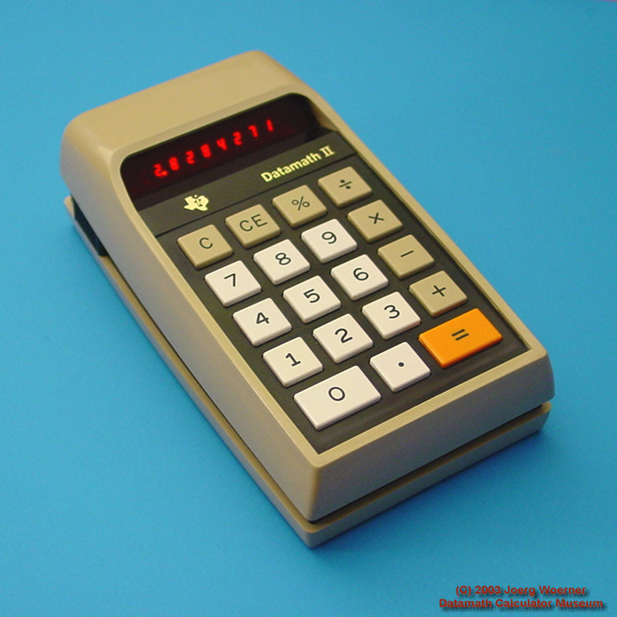
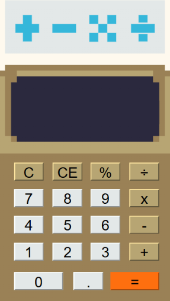

# Calculator HTML site

# About
Site purely made with **HTML** code, *CSS* and vanilla ***Javascript***.

# Inspiration
Was mainly drew from the vintage calculators, especially the type The Datamath II, known as TI-2500-II.

Below is a photo of the calculator and a visualization heavily inspired by this model, created primarily with the use of linear gradient providing the smooth transition of the colors between them.

  <video height="300"><source src="assets/calcvideo.mp4"></video>

[`Texas Instruments TI-2500-II / Datamath II`](http://www.datamath.org/BASIC/DATAMATH/ti-2500-II.htm)

This website was created to showcase my skills, demonstrate my approach to writing clean code, and illustrate how I customize the site’s appearance to suit my own preferences.
_______________________
Made by Klaudia Pietrzyk
